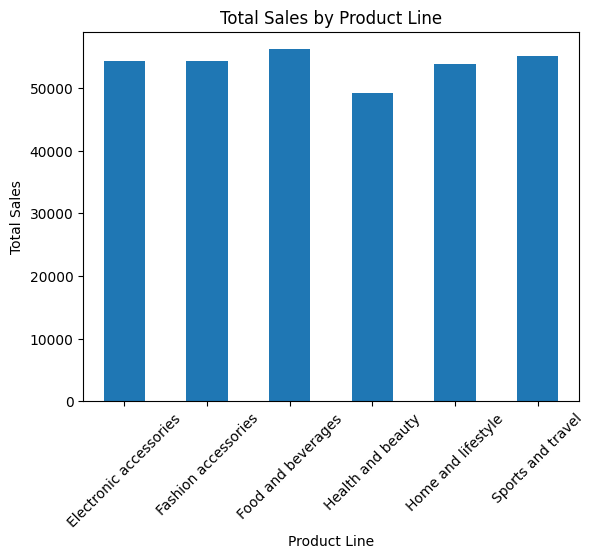
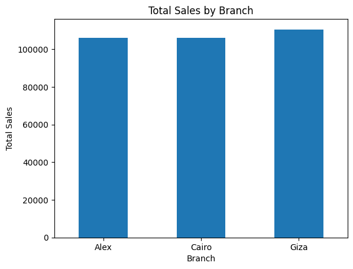
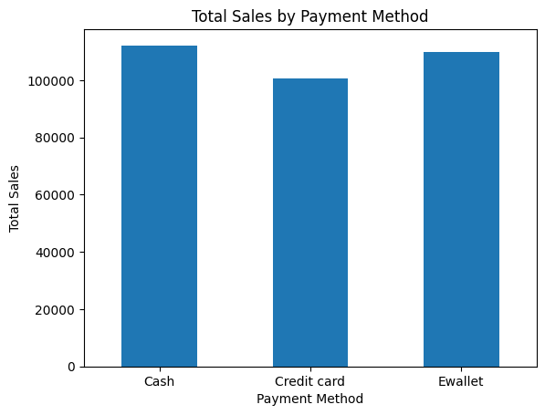
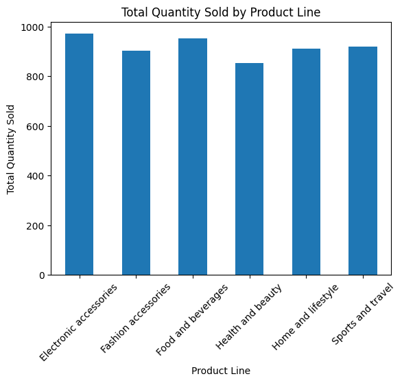
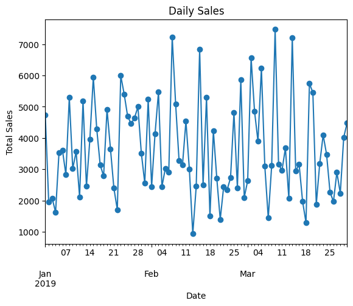

\# Supermarket Sales Analysis


\## About the Project


This is a beginner-level data analytics project where I worked with a supermarket sales dataset to understand the sales performance of different products, branches, cities, customer types, and payment methods.


I used Python to clean and explore the data and created some basic visualizations to make the results easier to understand.


This project was mainly created for \*\*practice and learning the basic workflow of a data analytics project\*\*.


\## What I Wanted to Find


Through this project, I wanted to answer some simple questions such as:


\* What are the total and average sales?

\* Which product line has the highest sales?

\* Which branch and city have the highest sales?

\* Which payment method is used most often?

\* Do Member or Normal customers generate more sales?

\* Which product line sells the most quantity?

\* How do sales change over time?

\* What does the distribution of sales look like?


\## Tools I Used


\* Python

\* Pandas

\* NumPy

\* Matplotlib

\* Seaborn

\* Jupyter Notebook

\* Git \& GitHub


\## Dataset


The dataset contains \*\*1,000 supermarket transactions\*\* with \*\*17 columns\*\*.


Some of the important columns are:


\* Invoice ID

\* Branch

\* City

\* Customer type

\* Gender

\* Product line

\* Unit price

\* Quantity

\* Sales

\* Date

\* Time

\* Payment

\* COGS

\* Gross income

\* Rating


\## Data Cleaning


Before starting the analysis, I first checked the dataset to make sure the data was ready to work with.


I checked:


\* Number of rows and columns

\* Column names

\* Data types

\* Missing values

\* Duplicate records


There were \*\*no missing values\*\* and \*\*no duplicate records\*\* in the dataset.


I also converted the `Date` and `Time` columns into datetime format so they could be used properly for analysis.


\## Analysis


I used Pandas to perform different types of analysis, including:


\* Total sales

\* Average sales

\* Highest and lowest transaction

\* Sales by product line

\* Sales by branch

\* Sales by city

\* Sales by customer type

\* Sales by payment method

\* Quantity sold by product line

\* Most common payment method

\* Sales over time

\* Sales distribution


\## Some Interesting Findings


Here are a few things I found while analyzing the data:


\*\*Total Sales:\*\*

The supermarket made total sales of approximately \*\*322,966.75\*\* from 1,000 transactions.


\*\*Product Lines:\*\*

Food and beverages had the highest total sales, while health and beauty had the lowest.


\*\*Branches:\*\*

Giza had the highest total sales among the three branches. The sales of Alex and Cairo were very close.


\*\*Customer Type:\*\*

Member customers generated more total sales than Normal customers. The average sales per transaction was also higher for Members.


\*\*Payment Methods:\*\*

Ewallet was the most commonly used payment method with \*\*345 transactions\*\*, followed closely by Cash with \*\*344 transactions\*\*.


\*\*Quantity Sold:\*\*

Electronic accessories had the highest quantity sold with \*\*971 units\*\*.


\*\*Cities:\*\*

Naypyitaw recorded the highest total sales among the three cities.


\## Visualizations


I created basic charts to understand the data better, including:


\* Bar charts for comparisons

\* Line chart for sales over time

\* Histogram for sales distribution


These charts made it easier to see differences and patterns in the dataset.


## Visualizations

### Sales by Product Line



### Sales by Branch



### Sales by Payment Method



### Quantity Sold by Product Line



### Sales Over Time




\## What I Learned


This project helped me understand the basic steps involved in a data analytics project.


I learned how to:


\* Load a CSV file using Pandas

\* Explore a dataset

\* Check and clean data

\* Work with dates and times

\* Group data and calculate totals and averages

\* Create basic visualizations

\* Find useful insights from data

\* Upload and manage a project using GitHub


\## Future Improvements


I would like to continue improving this project by adding things like:


\* Sales analysis by gender

\* Sales by day of the week

\* Monthly sales analysis

\* Customer rating analysis

\* Gross income analysis

\* An interactive dashboard using Power BI or Tableau


\## Project Structure


```text

supermarket-sales-analysis/

│

├── data/

│   └── SuperMarket Analysis.csv

│

├── notebook/

│   └── supermarket-sales-analysis.ipynb

│

├── images/

│   └── charts/

│

└── README.md

```


\## Conclusion


Overall, this was a good practice project for learning the basics of data analytics. It gave me hands-on experience with Python, Pandas, data visualization, and GitHub while working with a real-world-style sales dataset.


I plan to build more projects like this as I continue learning data analytics.


